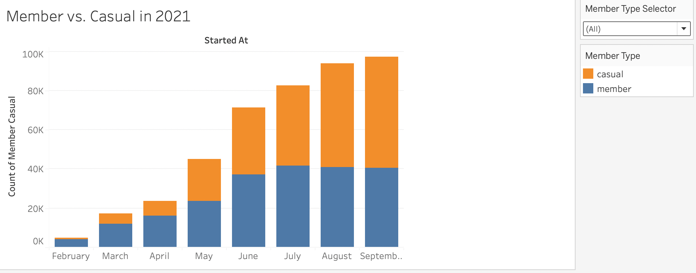

# The New York Citi Bike Data

Tableau workbook can be found [here](https://public.tableau.com/views/NewYorkCitiBikeAnalysis_16360854879020/NYCBStory?:language=en-US&publish=yes&:display_count=n&:origin=viz_share_link).

---

The New York Citi Bike program is the largest bike sharing program in the United States and has been collecting data since 2013. In order to reflect the most recent data format, for this analysis we will be using data that was collected between February 2021 through September 2021. New York Citi Bike’s Data can be found [here](https://ride.citibikenyc.com/system-data) on their site.

### Bike usage on the starting dates per month
On the Station Popularity by Month map we see circular bubbles that represent the bike count per station. These bike counts can be filtered per month to view how many bikes were used based on the starting date. If we compare the different months, it can be observed that during February 2021 less bikes were used and as we move later on into the year we see the bike usage increases leaving September 2021 as the month with the most bikes used. There are a couple assumptions that can be made as to why less bikes were used in February when compared to September, this could be simply because during the winter months there was less travel when compared to warmer months. The country was also dealing with covid restrictions and quarantine, and it can also be possible that as restrictions were lifted travel increased throughout the months.

### Top Stations Comparisons
For the bar chart based on Top Stations for 2021, we have all stations based on the started date organized by the most visited at the top and with the least visited at the bottom. As we filter through each month from February to September we see that the top stations change leaving Newport PATH as the top 10 and then having South Waterfront Walkway as the top station from June to September. This can correlate with the Station Popularity by Month map, since most stations may not have been open or just not visited during the first few months it makes sense that the top stations chart would fluctuate from the list when compared to the last months when bike usage increased. 

### Member Types
When reviewing the data, it was observed that there were two types of memberships, Member and Casual. For the beginning portion of the months there was a low count for both Member and Casual where February had the lowest count when compared to the later months such as July through September which showed a huge increase. It can also be observed from February through July there were more Members than Casual types and from August through September there were more Casuals than Member types. It can be assumed that perhaps there were more Casual members during August and September because warmer weather allowed for more travel. 

### Peak Hours throughout the day
On the Bike Usage Throughout the Day Chart, bike usage in hours throughout the day is compared on each month from February through September. Using the selector we can modify which months we want to compare.  If we observe each month we can see the peak hour for each is 6pm. One possible explanation could be that most people use citbike right after work to head home or to another destination. Based on other observations we can also see that the times when bikes are least used throughout the day are form 12am to 6am. 

